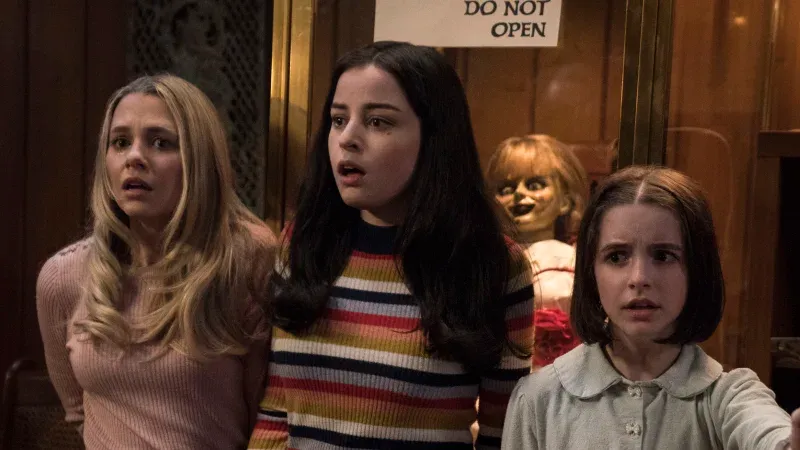

<!-- # Review Annabelle: Comes Home (2019) -->

## Introduction

Have you ever encounter a doll that can switch place by themselves? Its Annabelle: Comes Home, released on June 26, 2019. Its a horror suspense movie. This movie is about such three ladies (i think they're junior high school) live in such a scary house and they need to fix a problem made by one of them. i thought it was gonna be some classical conjuring movies where ed and lorraine gonna be the main characters, but it is not.

## Plot Summary

<!-- [Lorraine Exorcist Annabelle Doll](./images/annabelle-comes-home-lorraine-exorcist-annabelle.avif) -->

Judy Warren, daughter of ed and lorraine warren is gonna make a birthday party at her home. Mary Ellen and Danielle (mary's friend) come to judy home to help her to prepare the birthday party for tomorrow. But, something is happening to all these girls. Unfortunately, judy's parent isn't at home.

## Acting and Performances

Their performances is not that good. I mean, they are still a child and still have so much time to improve. Judy as a rigid person, know how other people feel about, Mary Ellen as a cheerful girl, and Danielle as a naughty girl.
