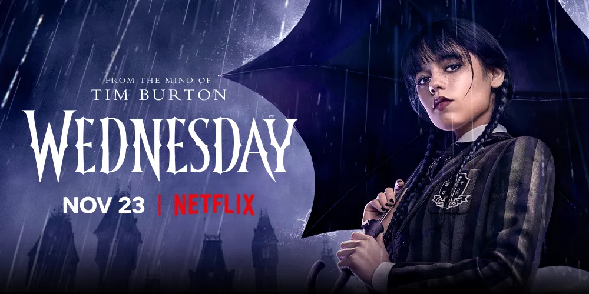
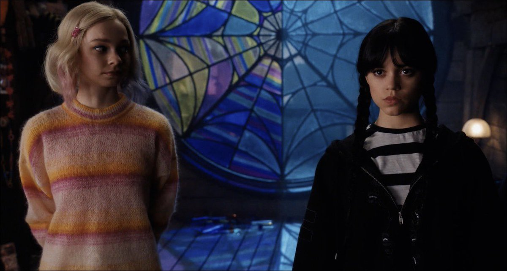

# Review Wednesday - Netflix Series

## Sinopsis

Sebuah misteri supernatural yang menggambarkan tahun-tahun Wednesday Addams sebagai siswa di Nevermore Academy. Upaya Wednesday untuk mengendalikan kemampuan psikisnya yang muncul, menggagalkan pembunuhan besar-besaran yang telah meneror kota setempat, dan memecahkan misteri supernatural yang melibatkan orang tuanya 25 tahun lalu - semuanya sambil menavigasi hubungan barunya yang sangat kusut di Nevermore.

## Wednesday Karakter yang Mandiri dan Dapat Berpikir dengan Sangat Rasional (Diawal Cerita)

Wednesday merupakan karakter yang sangat mandiri. Dia percaya dapat hidup sendiri tanpa orang lain.  Wednesday bukanlah wanita yang suka basa-basi. Tidak peduli apa kata orang _(seperti buku Berani Tidak Disukai)_ dia selalu maju kedepan\_.

Wednesday juga sangat rasional. Ia dapat mengambil keputusan yang cukup baik ketika emosi dia tidak meluap-luap. Akan tetapi, menjelang akhir episode, dia tidak berhati-hati dalam mengambil keputusan seperti menuduh orang sembarangan tanpa bukti valid, hanya mengandalkan kekuatan supernatural-nya sehingga beberapa orang menjadi korbannya. Meskipun dia bisa berpikir sangat rasional, Wednesday tidak bisa menyeimbangkan pikiran dan emosinya. Sering kali Ia mengabaikan/tidak terlalu memperhatikan keadaan orang disekitarnya.

## Hubungan Pertemanan yang Sangat EPIC

Wednesday memiliki teman satu kamar yang sangat baik (Enid yang diperankan oleh Emma Myers). Pertemanan mereka sangat kental, Diawal cerita hubungan mereka cukup baik. Ketika dipertengahan, mereka mulai renggang karena Enid merasa Wednesday tidak memperlakukan dirinya dan orang lain dengan semestinya. Namun demikian, mereka kembali bekerja sama untuk menyelesaikan masalah.

Wednesday cenderung ringan untuk ditonton remaja Indonesia. Topik yang dibawa tidak begitu berat, hanya monster yang berkeliaran disekitar sekolahnya. Wednesday ingin menyelesaikan kasus tersebut. Mungkin yang membuat seri ini berat adalah sikap Wednesday yang agak sulit untuk dimengerti.

## References

[Wednesday (TV Series 2022– ) - IMDb](https://www.imdb.com/title/tt13443470/)
