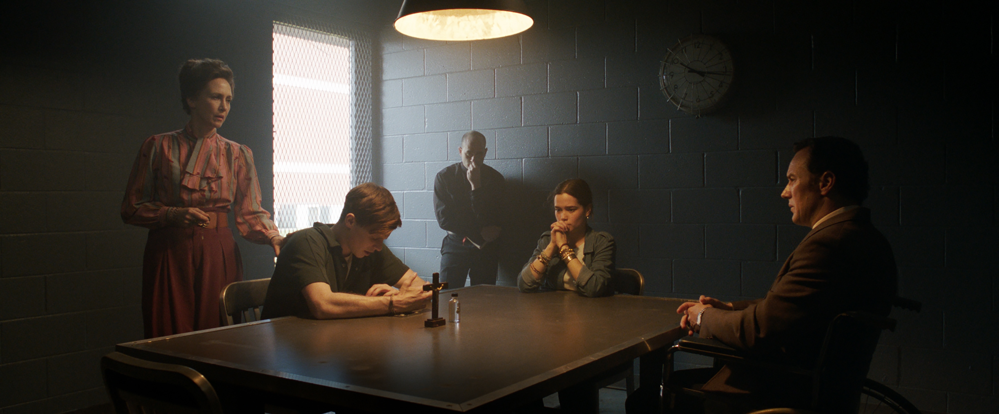

## Introduction

Can you imagine your days blackmailed by a witch? The Conjuring 3: The Devil Made Me Do it is the third movie of the conjuring movies. It releases on 2021 at the middle of covid. It differs from usual The Conjuring movies. The first two movies are about haunted houses and the demon want to chase away its inhabitants. The third movie is about witch that could blackmailed from a very long distances.

## Plot Summary

David Glatzel, a kid that got posessed by a demon blackmailed by an unknown witch gets exorcism by Ed and Lorraine Warren couple.
The house becomes disaster because of that. Arne Johnson, Debbie Glatzel's (big sister of David Glatzel) boyfriend asks the demon to let david live and as a replacement, Arne gonna be possessed. For David, this is the end of David's misery. But for Arne, this is the beginning of his suffering.

## My Opinion

This movie isnt scarier than the first two movies. It has a realistic enemy which is human being. The unrealistic part of course the demonic part. But, as a horror movie, I still enjoy it. The first conjuring movie still the best conjuring movies and then second movie.

## Acting and Performances

As always, Ed and Lorraine actings has been tested by various movies, especially The Conjuring and The Conjuring 2. Arne, as a possessed person got a big OK from me because he has a good work. He good at being possessed by demon.

## Plot and Storyline

The movie based on true story. I dont really wish so much because the director would be limited to use their creativity cos its limitations. The storyline isnt really good, but I appreciate the bravery of the director to bring such a new thing which is blackmailed thing in this movie.
